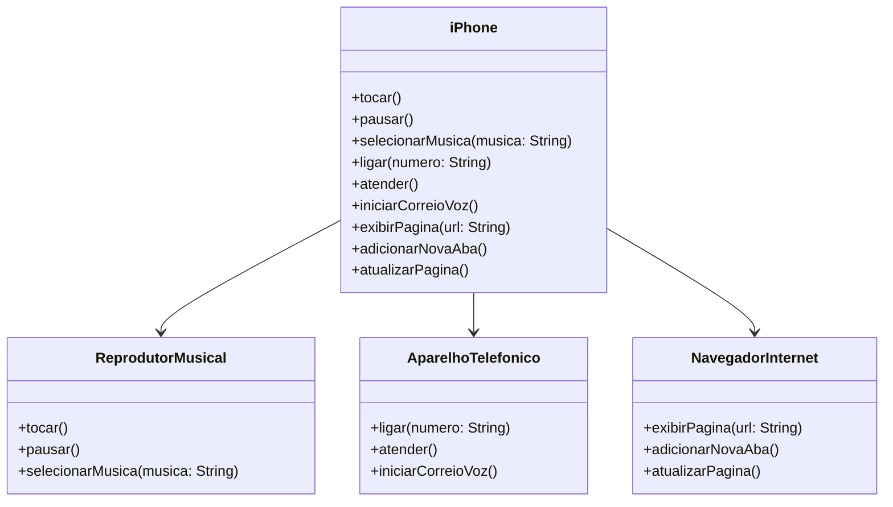

# 📱 Simulação do iPhone 2007 - Java + UML

Este projeto simula as funcionalidades principais demonstradas no lançamento do iPhone em 2007 (minuto 00:15 até 00:55 do vídeo oficial da Apple). Foi modelado com base em três funcionalidades principais: reprodutor musical, aparelho telefônico e navegador de internet. O projeto usa Java e diagramas UML para representar a estrutura orientada a objetos.

---

## 🎯 Funcionalidades Modeladas

### 🎵 Reprodutor Musical
- `tocar()` – Inicia a reprodução da música.
- `pausar()` – Pausa a música atual.
- `selecionarMusica(String musica)` – Seleciona uma música específica pelo nome.

### 📞 Aparelho Telefônico
- `ligar(String numero)` – Faz uma ligação para o número informado.
- `atender()` – Atende uma chamada.
- `iniciarCorreioVoz()` – Acessa o correio de voz.

### 🌐 Navegador na Internet
- `exibirPagina(String url)` – Exibe uma página da web.
- `adicionarNovaAba()` – Abre uma nova aba no navegador.
- `atualizarPagina()` – Atualiza a página atual.

---

